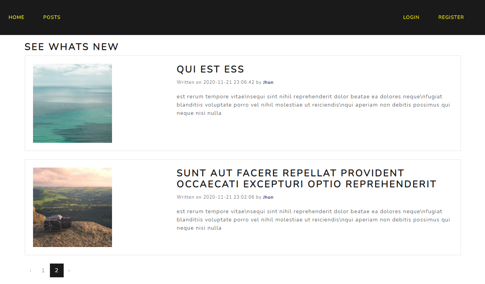
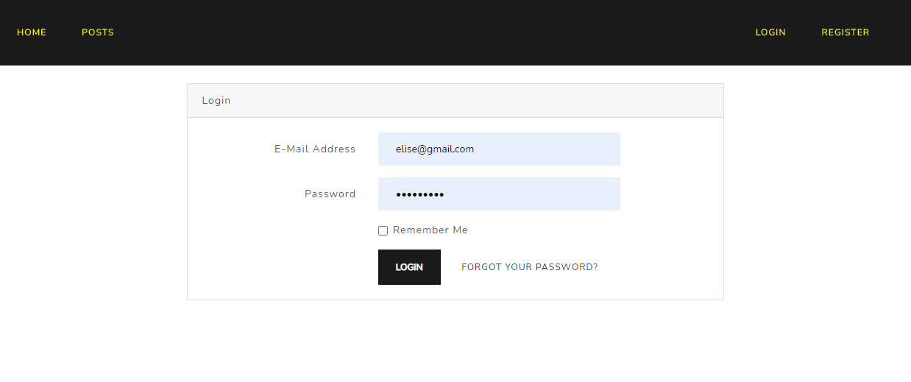
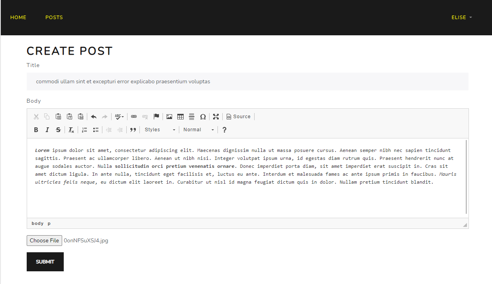

# Blog Web application - Laravel + Bootstrap

## Getting started

```bash
# Install composer Depencies 
$ composer install

# Install node Depencies (bootsrap, if needed)
$ npm install
```

```bash
# Migrate tables
$ php artisan migrate
```

```bash
# Generate encryption key - may not be required
php artisan key:generate
```


## About

A blog web application where users , register and log in and perform <strong>CRUD</strong> operations such as creating, editing, updated and deleting posts. 








